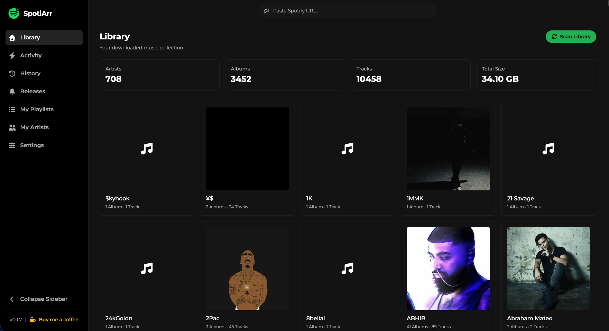
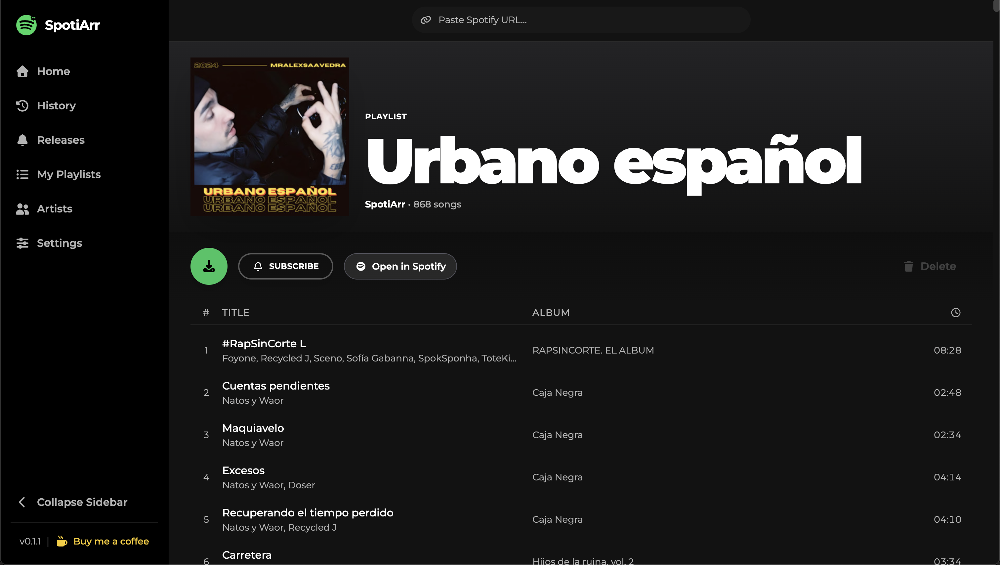
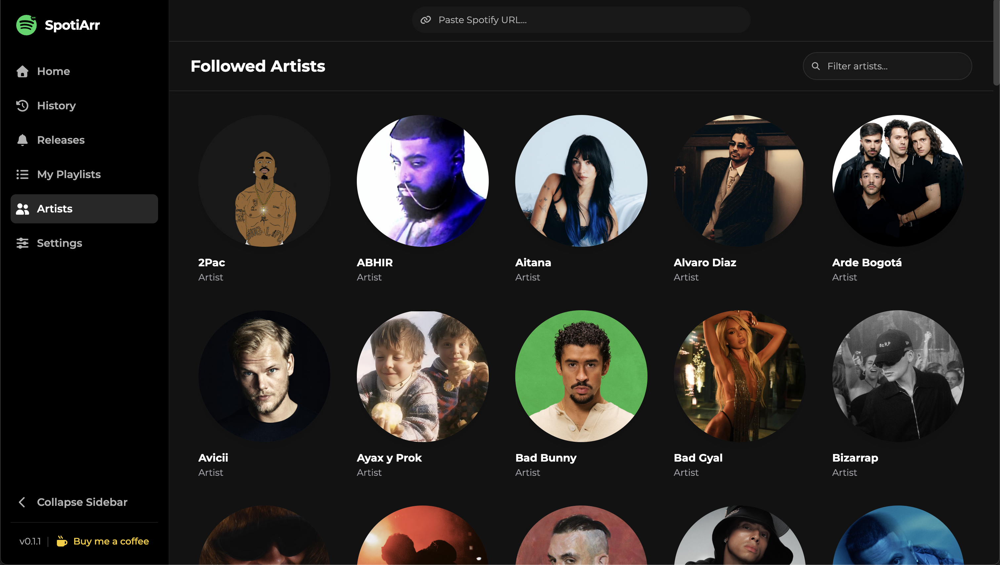
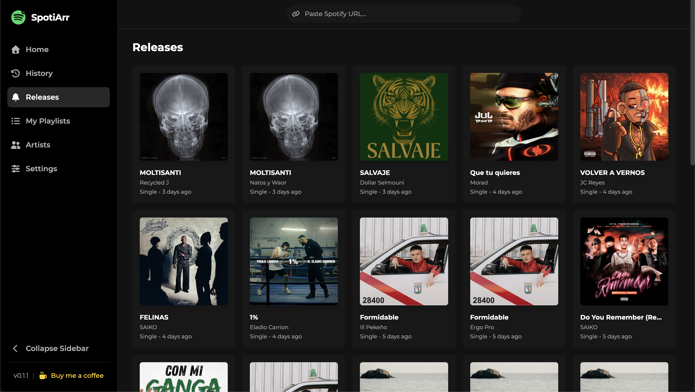
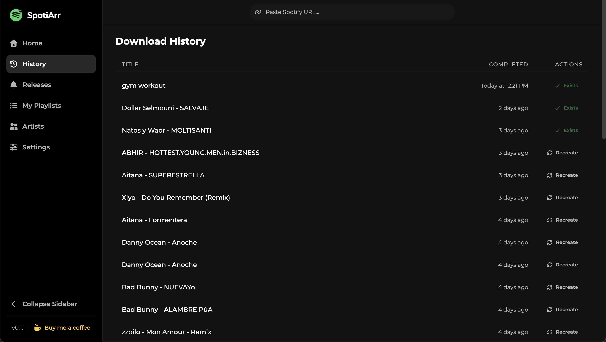
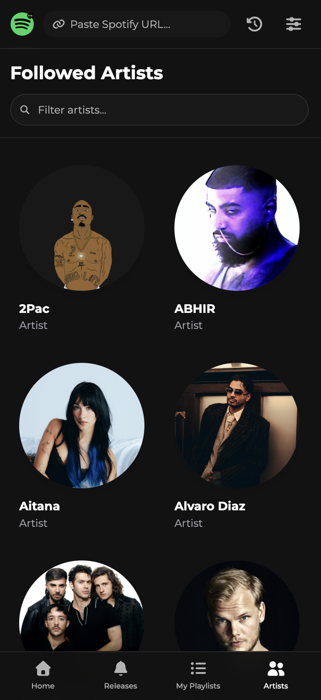
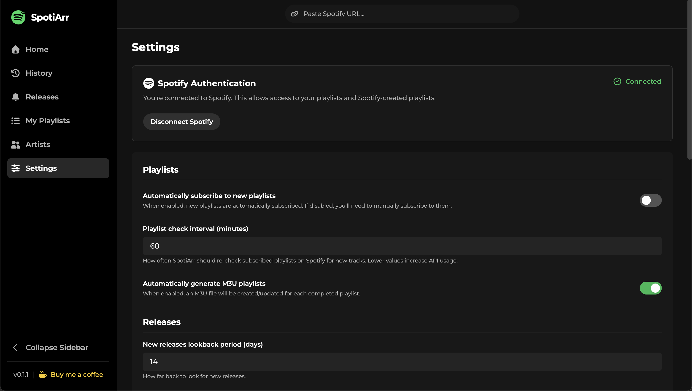

<div align="center">

<a href="https://github.com/mralexsaavedra/spotiarr">
  
</a>

# SpotiArr

**Self-hosted Spotify downloader with Jellyfin/Plex integration**

[](LICENSE)
[](https://github.com/mralexsaavedra/spotiarr/releases)
[](https://hub.docker.com/r/mralexandersaavedra/spotiarr)
[](https://github.com/mralexsaavedra/spotiarr)
[](https://buymeacoffee.com/mralexsaavedra)

Download Spotify playlists, albums, and tracks with automatic metadata tagging and Jellyfin-ready folder structure.

[Quick Start](#-quick-start) • [Features](#-features) • [Installation](#-installation) • [Configuration](#%EF%B8%8F-configuration)

</div>

---

## ✨ Features

| Feature                    | Description                                                                 |
| -------------------------- | --------------------------------------------------------------------------- |
| 🎵 **Smart Downloads**     | Paste any Spotify URL (track/album/playlist) and download with metadata     |
| 🔄 **Auto-Sync Playlists** | Subscribe to playlists for automatic updates when new tracks are added      |
| 📁 **Jellyfin-Ready**      | Organized folder structure (`Playlists/`, `Artist/Album/`) + M3U generation |
| 🎨 **Modern UI**           | Spotify-inspired dark theme with real-time progress tracking                |
| 🏷️ **Rich Metadata**       | Automatic tagging (artist, album, year, cover art embedded + saved)         |
| 🚫 **Duplicate Detection** | Smart checks to avoid re-downloading existing tracks                        |
| 🐳 **Docker First**        | One-command deployment with Redis included                                  |

**Stack:** Express + Prisma + React 19 + Vite + Tailwind + SQLite + Redis + BullMQ

> [!IMPORTANT]  
> **Legal Notice:** Personal use only. Download music you have legal rights to access. The author is not responsible for misuse.

## 📸 Interface

<details>
  <summary><strong>Click to view Interface Screenshots</strong></summary>
  <br>

<div align="center">
  
  <br>
  <em>Modern Dashboard with Real-time Status</em>
  <br><br>

  
  <br>
  <em>Rich Playlist Management & Track Selection</em>
  <br><br>

  
  
  <br>
  <em>Artist Library & New Releases Tracking</em>
  <br><br>

  
  <br>
  <em>Comprehensive Download History</em>
  <br><br>

  
  
  <br>
  <em>Fully Responsive Mobile Design & Comprehensive Settings</em>
</div>

</details>

## 📱 Application Views

- **🏠 Home:** Dashboard with recent activity, active downloads, and quick actions.
- **📜 History:** Comprehensive log of all downloaded tracks and playlists.
- **🔔 Releases:** New releases from your followed artists.
- **💾 My Playlists:** Browse and import your followed Spotify playlists directly.
- **👥 Artists:** Manage your followed artists and view their discography.
- **⚙️ Settings:** Configure download preferences, directories, and application behavior.

## 🚀 Quick Start

### Prerequisites

1. **Get Spotify API credentials** (free):
   - Go to [Spotify Developer Dashboard](https://developer.spotify.com/dashboard)
   - Create an app → note your `Client ID` and `Client Secret`
   - **Set redirect URI:** Add this to your Spotify Developer Dashboard:
   - `http://127.0.0.1:3000/api/auth/spotify/callback` (Local Development)
   - `https://YOUR_SERVER_IP/api/auth/spotify/callback` (Production with Traefik - replace `YOUR_SERVER_IP` with actual IP)

2. **Run with Docker Compose** (recommended):

   Includes Redis, Traefik (Reverse Proxy), health checks, and persistent storage.

```bash
# 1. Clone repo
git clone https://github.com/mralexsaavedra/spotiarr.git && cd spotiarr

# 2. Configure
cp .env.example .env
# Edit .env → add:
#   SPOTIFY_CLIENT_ID=your_client_id
#   SPOTIFY_CLIENT_SECRET=your_client_secret
#   # Configure Callback URL (Note: No port 3000 needed with Traefik)
#   SPOTIFY_REDIRECT_URI=https://YOUR_SERVER_IP/api/auth/spotify/callback
#   DOWNLOADS_DIR=/path/to/downloads
#   PUID=1000  # Optional (Linux/NAS)
#   PGID=1000  # Optional (Linux/NAS)

# 3. Start
docker compose up -d
```

3. **Open** → `https://YOUR_SERVER_IP` 🎉
   - Accept the self-signed certificate warning (Traefik generates this automatically)
   - Login with Spotify to authorize the app

## 📦 Installation

### Build from Source

**Requirements:** Node.js 20+, pnpm 9+, Redis, FFmpeg, yt-dlp, Python 3.11/3.12

```bash
# 1. Setup
git clone https://github.com/mralexsaavedra/spotiarr.git && cd spotiarr
corepack enable
pnpm install

# 2. Install services (macOS example)
brew install redis ffmpeg yt-dlp
brew services start redis

# 3. Configure
cp .env.example .env
cp apps/backend/.env.example apps/backend/.env
# Edit .env → add Spotify credentials + set REDIS_HOST=localhost
# Note: Downloads are saved to './downloads' by default

# 4. Migrate Database
pnpm --filter backend run prisma:migrate:deploy

# 5. Run
pnpm dev
# Frontend: http://localhost:5173 (Hot Reload)
# Backend:  http://localhost:3000 (API)
```

## ⚙️ Configuration

### Environment Variables

**User-configurable variables:**

| Variable                | Required    | Default | Description                                      |
| ----------------------- | ----------- | ------- | ------------------------------------------------ |
| `SPOTIFY_CLIENT_ID`     | ✅          | -       | Spotify app Client ID                            |
| `SPOTIFY_CLIENT_SECRET` | ✅          | -       | Spotify app Client Secret                        |
| `SPOTIFY_REDIRECT_URI`  | ✅          | -       | Full Callback URL (e.g. `https://IP/...`)        |
| `DOWNLOADS_DIR`         | ✅ (Docker) | -       | Host path for downloads mapping (Docker Compose) |

| `PUID` | ❌ | `1000` | User ID for file permissions (Linux/NAS) |
| `PGID` | ❌ | `1000` | Group ID for file permissions (Linux/NAS) |

**Advanced Configuration:**

| Variable     | Default | Description                                |
| ------------ | ------- | ------------------------------------------ |
| `REDIS_HOST` | `redis` | Hostname of Redis server (for external DB) |
| `REDIS_PORT` | `6379`  | Port of Redis server                       |

**Note regarding HTTPS:**
The included `docker-compose.yml` uses **Traefik** as a reverse proxy to handle HTTPS automatically on port 443. This is required for Spotify authentication on remote servers. SpotiArr itself runs on HTTP (port 3000) internally.

> For advanced/internal variables, see [CONTRIBUTING.md](CONTRIBUTING.md#environment-variables)

### In-App Settings

Most options are configured via the **Settings** page (stored in database):

- **Spotify Market/Region** → ISO country code for content availability
- **Downloads path** → where files are saved
- **Audio format** → mp3, m4a, etc.
- **YouTube cookies** → paste content of cookies.txt for age-restricted content (optional)
- **M3U generation** → auto-create playlist files
- **Download rate limit** → avoid YouTube throttling
- **Playlist sync interval** → how often to check for new tracks (default: 60 min)

## 📁 File Organization

SpotiArr follows Jellyfin/Plex best practices:

```
downloads/
├── Playlists/
│   └── My Playlist/
│       ├── 01 - Artist - Track.mp3
│       ├── My Playlist.m3u8
│       └── cover.jpg
└── Artist Name/
    └── Album Name/
        ├── 01 - Track.mp3
        └── cover.jpg
```

- **Metadata** embedded in files (artist, album, year, cover)
- **M3U playlists** auto-generated for easy import
- **Cover art** saved as `cover.jpg` + embedded

## 🛠️ Development

Contributions welcome! See [CONTRIBUTING.md](CONTRIBUTING.md) for setup, workflow, and guidelines.

**Quick commands:**

```bash
pnpm dev       # Backend + frontend
pnpm lint      # ESLint + Prettier
pnpm build     # Production build
```

**Architecture:**

> 📖 **Read the Story:** See [docs/ARCHITECTURE.md](docs/ARCHITECTURE.md) (Español) or [docs/ARCHITECTURE.en.md](docs/ARCHITECTURE.en.md) (English) for a deep dive into the project's initiative, monorepo structure, and technical decisions.

- **Backend:** Express + Prisma + BullMQ + SQLite
- **Frontend:** React 19 + Vite + TanStack Query + Tailwind v4 + Zustand
- **Queue:** Redis + BullMQ for download jobs
- **Processing:** FFmpeg + yt-dlp

## 📝 Changelog

See [CHANGELOG.md](CHANGELOG.md) for version history.

## 💬 Support

- 🐛 [Open an issue](https://github.com/mralexsaavedra/spotiarr/issues)
- 💡 [Discussions](https://github.com/mralexsaavedra/spotiarr/discussions)
- ⭐ Star the repo if you find it useful!

## ⚖️ License

[MIT](LICENSE) © [mralexsaavedra](https://github.com/mralexsaavedra)

---

<div align="center">

Made with ❤️ for the self-hosting community

[](https://buymeacoffee.com/mralexsaavedra)

</div>
