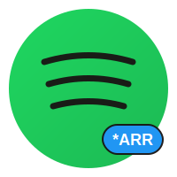

[](https://github.com/mralexsaavedra/spotiarr)
[](https://github.com/mralexsaavedra/spotiarr)
[](https://github.com/mralexsaavedra/spotiarr/releases)
[](https://hub.docker.com/r/mralexandersaavedra/spotiarr)


# SpotiArr - Self-hosted Spotify Downloader

> **A powerful, self-hosted solution for downloading and organizing your Spotify music library with seamless Jellyfin integration.**

SpotiArr bridges the gap between Spotify and your personal media server. Download tracks, albums, and entire playlists with automatic metadata tagging, smart folder organization, and native Jellyfin compatibility. Perfect for music enthusiasts who want complete control over their music collection.

## ✨ Key Features

### 🎵 **Smart Music Management**
- Download tracks, albums, and playlists from Spotify URLs
- Automatic metadata tagging (artist, album, year, cover art)
- Subscribe to playlists for automatic updates when new tracks are added
- Smart duplicate detection

### 📁 **Jellyfin-Ready Organization**
- Automatic folder structure following Jellyfin best practices
- Separate organization for playlists vs. albums
- Automatic M3U8 playlist generation for easy imports
- Cover art embedded in files and saved as `cover.jpg`

### 🎨 **Modern User Interface**
- Spotify-inspired dark mode design
- Real-time download progress tracking
- Multiple artist support with clickable profile links
- Responsive design for desktop and mobile

### 🔗 **Ecosystem Integration**
- Native Jellyfin compatibility
- Works with Navidrome, Plex, and other media servers
- *ARR ecosystem ready (Radarr, Sonarr, Lidarr patterns)
- Docker support for easy deployment

**Tech Stack:** NestJS (Backend) + Angular 19 (Frontend) + Tailwind CSS + SQLite + Redis

> [!IMPORTANT]
> **Legal Notice:** This tool is intended for personal use only. Download only music you have legal rights to access. The author is not responsible for any misuse of this software.

## 🚀 Quick Start

```bash
# Using Docker (recommended)
docker run -d -p 3000:3000 \
  -v /path/to/music:/spotiarr/backend/downloads \
  -e SPOTIFY_CLIENT_ID=your_client_id \
  -e SPOTIFY_CLIENT_SECRET=your_client_secret \
  mralexandersaavedra/spotiarr:latest
```

Then open http://localhost:3000 in your browser!

## 📚 Table of Contents
- [SpotiArr - Self-hosted Spotify Downloader](#spotiarr---self-hosted-spotify-downloader)
  - [✨ Key Features](#-key-features)
    - [🎵 **Smart Music Management**](#-smart-music-management)
    - [📁 **Jellyfin-Ready Organization**](#-jellyfin-ready-organization)
    - [🎨 **Modern User Interface**](#-modern-user-interface)
    - [🔗 **Ecosystem Integration**](#-ecosystem-integration)
  - [🚀 Quick Start](#-quick-start)
  - [📚 Table of Contents](#-table-of-contents)
  - [🚀 Installation](#-installation)
    - [Spotify App Configuration](#spotify-app-configuration)
    - [Docker](#docker)
      - [Docker command](#docker-command)
      - [Docker compose](#docker-compose)
    - [Build from source](#build-from-source)
      - [Requirements](#requirements)
      - [Process](#process)
    - [Environment variables](#environment-variables)
    - [How to get your YouTube cookies (using browser dev tools):](#how-to-get-your-youtube-cookies-using-browser-dev-tools)
    - [🎵 M3U Playlist Generation](#-m3u-playlist-generation)
  - [📺 Jellyfin Integration](#-jellyfin-integration)
  - [🤝 Contributing](#-contributing)
  - [📝 Changelog](#-changelog)
  - [💬 Support](#-support)
  - [⭐ Show Your Support](#-show-your-support)
- [⚖️ License](#️-license)

## 🚀 Installation
Recommended and the easiest way how to start to use of SpotiArr is using docker.

### Spotify App Configuration

To fully use SpotiArr, you need to create an application in the Spotify Developer Dashboard:

1. Go to [Spotify Developer Dashboard](https://developer.spotify.com/dashboard)
2. Sign in with your Spotify account
3. Create a new application
4. Note your `Client ID` and `Client Secret`
5. Configure the redirect URI to `http://localhost:3000/api/callback` (or the corresponding URL of your instance)

These credentials will be used by SpotiArr to access the Spotify API.

### Docker

Just run docker command or use docker compose configuration.
For detailed configuration, see available [environment variables](#environment-variables).

#### Docker command
```shell
docker run -d -p 3000:3000 \
  -v /path/to/downloads:/spotiarr/backend/downloads \
  -e SPOTIFY_CLIENT_ID=your_client_id \
  -e SPOTIFY_CLIENT_SECRET=your_client_secret \
  mralexandersaavedra/spotiarr:latest
```

#### Docker compose
```yaml
services:
  spotiarr:
    image: mralexandersaavedra/spotiarr:latest
    container_name: spotiarr
    restart: unless-stopped
    ports:
      - "3000:3000"
    volumes:
      - /path/to/downloads:/spotiarr/backend/downloads
    environment:
      - SPOTIFY_CLIENT_ID=your_client_id
      - SPOTIFY_CLIENT_SECRET=your_client_secret
      # Configure other environment variables if needed
```

### Build from source

SpotiArr can be also build from source files on your own.

#### Requirements
- Node v18.19.1 (it is recommended to use `nvm` node version manager to install proper version of node)
- Redis in memory cache
- Ffmpeg
- Python3

#### Process
- install Node v18.19.1 using `nvm install` and use that node version `nvm use`
- from project root install all dependencies using `npm install --legacy-peer-deps`
- copy `.env.default` as `.env` in `src/backend` folder and modify desired environment properties (see [environment variables](#environment-variables))
- add your Spotify application credentials to the `.env` file:
  ```
  SPOTIFY_CLIENT_ID=your_client_id
  SPOTIFY_CLIENT_SECRET=your_client_secret
  ```
- build source files `npm run build`
    - built project will be stored in `dist` folder
- start server `npm run start`

### Environment variables

Some behaviour and settings of SpotiArr can be configured using environment variables and `.env` file.

 Name                 | Default                                     | Description                                                                                                                                                      |
----------------------|---------------------------------------------|------------------------------------------------------------------------------------------------------------------------------------------------------------------|
 DB_PATH              | `./config/db.sqlite` (relative to backend)  | Path where SpotiArr database will be stored                                                                                                                        |
 FE_PATH              | `../frontend/browser` (relative to backend) | Path to frontend part of application                                                                                                                             |
 DOWNLOADS_PATH       | `./downloads` (relative to backend)         | Path where downaloded files will be stored                                                                                                                       |
 FORMAT               | `mp3`                                       | Format of downloaded files (currently fully supported only `mp3` but you can try whatever you want from [ffmpeg](https://ffmpeg.org/ffmpeg-formats.html#Muxers)) |
 PORT                 | 3000                                        | Port of SpotiArr server                                                                                                                                            |
 REDIS_PORT           | 6379                                        | Port of Redis server                                                                                                                                             |
 REDIS_HOST           | localhost                                   | Host of Redis server                                                                                                                                             |
 RUN_REDIS            | false                                       | Whenever Redis server should be started from backend (recommended for Docker environment)                                                                        |
 SPOTIFY_CLIENT_ID    | your_client_id                              | Client ID of your Spotify application (required)                                                                                                                  |
 SPOTIFY_CLIENT_SECRET| your_client_secret                          | Client Secret of your Spotify application (required)                                                                                                              |
 YT_DOWNLOADS_PER_MINUTE | 3                                           | Set the maximum number of YouTube downloads started per minute                                                                                                  |
 YT_COOKIES           |                                             | Allows you to pass your YouTube cookies to bypass some download restrictions. See [below](#how-to-get-your-youtube-cookies) for instructions.                   |
 M3U_GENERATION_ENABLED | `true` | Enable/disable automatic M3U playlist generation. When enabled, M3U8 playlist files are automatically created for Spotify playlists (not for albums or single tracks). These playlists are compatible with Jellyfin, VLC, and other M3U-compatible players. |


### How to get your YouTube cookies (using browser dev tools):
1. Go to https://www.youtube.com and log in if needed.
2. Open the browser developer tools (F12 or right click > Inspect).
3. Go to the "Application" tab (in Chrome) or "Storage" (in Firefox).
4. In the left menu, find "Cookies" and select https://www.youtube.com.
5. Copy all the cookies (name=value) and join them with a semicolon and a space, like:
   VISITOR_INFO1_LIVE=xxxx; YSC=xxxx; SID=xxxx; ...
6. Paste this string into the YT_COOKIES environment variable (in your .env or Docker config).

### 🎵 M3U Playlist Generation
SpotiArr automatically generates M3U8 playlist files when downloading playlists from Spotify.

## 📺 Jellyfin Integration

SpotiArr organizes your music library following Jellyfin's recommended structure:

- **Playlists:** `downloads/Playlists/PlaylistName/01 - Artist - Track.mp3`
- **Albums:** `downloads/Artist/Album/01 - Track.mp3`
- **Cover Art:** Automatically saved as `cover.jpg` in each folder
- **M3U Files:** Generated for playlists for easy import

For detailed setup instructions, see [JELLYFIN_SETUP.md](JELLYFIN_SETUP.md)

## 🤝 Contributing

Contributions are welcome! Please feel free to submit a Pull Request. For major changes, please open an issue first to discuss what you would like to change.

## 📝 Changelog

See [CHANGELOG.md](CHANGELOG.md) for a list of changes in each version.

## 💬 Support

If you encounter any issues or have questions:
- Open an [issue](https://github.com/mralexsaavedra/spotiarr/issues)
- Check existing issues for solutions
- Read the [Jellyfin Integration Guide](JELLYFIN_SETUP.md)

## ⭐ Show Your Support

If you find SpotiArr useful, please consider giving it a star on GitHub! It helps the project gain visibility and encourages further development.

# ⚖️ License
[MIT](https://choosealicense.com/licenses/mit/)
