<div align="center">

<a href="https://github.com/mralexsaavedra/spotiarr">
  
</a>

# SpotiArr

**Self-hosted Spotify downloader with Jellyfin/Plex integration**

[](LICENSE)
[](https://github.com/mralexsaavedra/spotiarr/releases)
[](https://hub.docker.com/r/mralexandersaavedra/spotiarr)
[](https://github.com/mralexsaavedra/spotiarr)
[](https://buymeacoffee.com/mralexsaavedra)

Download Spotify playlists, albums, and tracks with automatic metadata tagging and Jellyfin-ready folder structure.

[Quick Start](#-quick-start) • [Features](#-features) • [Installation](#-installation) • [Configuration](#%EF%B8%8F-configuration)

</div>

---

## ✨ Features

| Feature                    | Description                                                                                                          |
| -------------------------- | -------------------------------------------------------------------------------------------------------------------- |
| 🎵 **Smart Downloads**     | Paste any Spotify URL (track/album/playlist) and download with metadata                                              |
| 🔍 **Live Search**         | Fast debounced search synchronized with browser history and parameters                                               |
| 🎧 **Native Player**       | Spotify-style playback for downloaded tracks with queue, shuffle, and repeat                                         |
| 📚 **Built-in Library**    | Browse your downloaded music organized by artists, albums, and tracks                                                |
| 🔄 **Auto-Sync Playlists** | Subscribe to playlists for automatic updates when new tracks are added                                               |
| 🤖 **AI Playlists**        | Describe a playlist in natural language — an LLM suggests tracks, SpotiArr resolves and downloads them automatically |
| 📁 **Jellyfin-Ready**      | Organized folder structure (`Playlists/`, `Artist/Album/`) + M3U generation                                          |
| 🎨 **Modern UI**           | Spotify-inspired dark theme with real-time progress tracking                                                         |
| 🏷️ **Rich Metadata**       | Automatic tagging (artist, album, year, cover art embedded + saved)                                                  |
| 🐳 **Docker First**        | One-command deployment with Redis included                                                                           |

**Stack:** Express + Prisma + React 19 + Vite + Tailwind 4 + SQLite + Redis + BullMQ + Vercel AI SDK

> [!IMPORTANT]  
> **Legal Notice:** Personal use only. Download music you have legal rights to access. The author is not responsible for misuse.

## 📸 Interface

<details>
  <summary><strong>Click to view Interface Screenshots</strong></summary>
  <br>

<div align="center">
  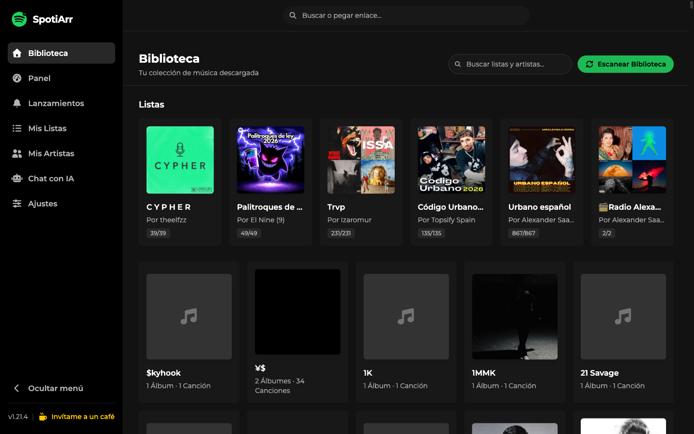
  <br>
  <em>Built-in Native Music Library</em>
  <br><br>

  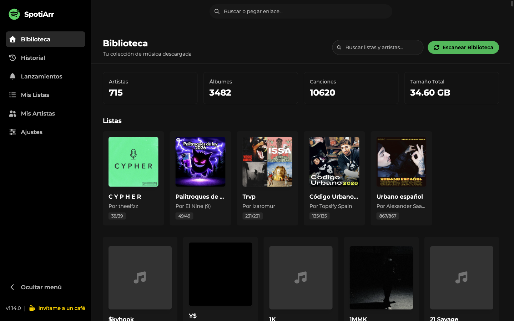
  <br>
  <em>Dashboard — Library Stats, Most-Listened & Download History</em>
  <br><br>

  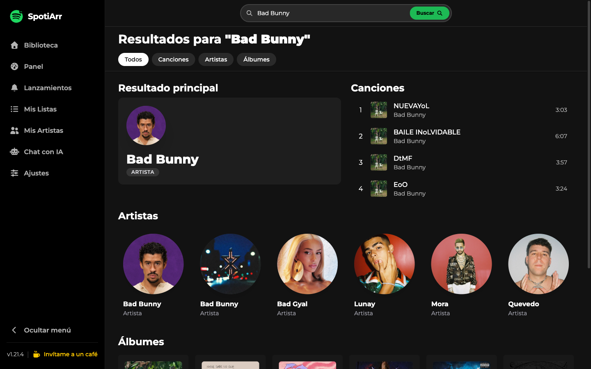
  <br>
  <em>Live Search across Spotify's catalog</em>
  <br><br>

  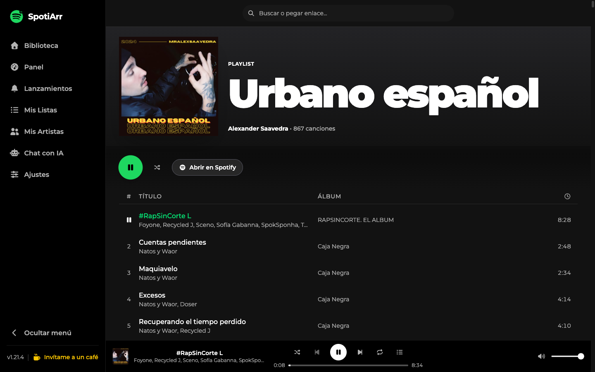
  <br>
  <em>Native Player with full Queue and Playback Controls (Desktop)</em>
  <br><br>

  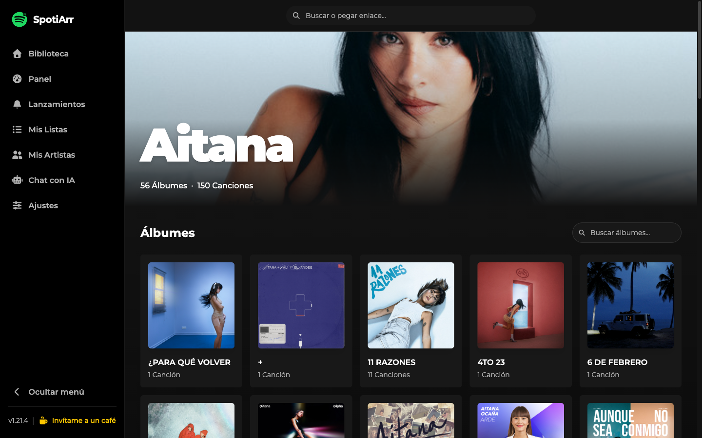
  <br>
  <em>Artist Profile with Discography & Metadata</em>
  <br><br>

  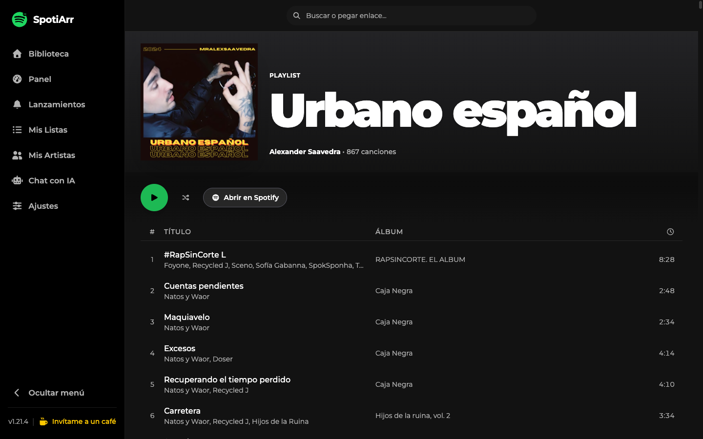
  <br>
  <em>Rich Playlist Management & Track Selection</em>
  <br><br>

  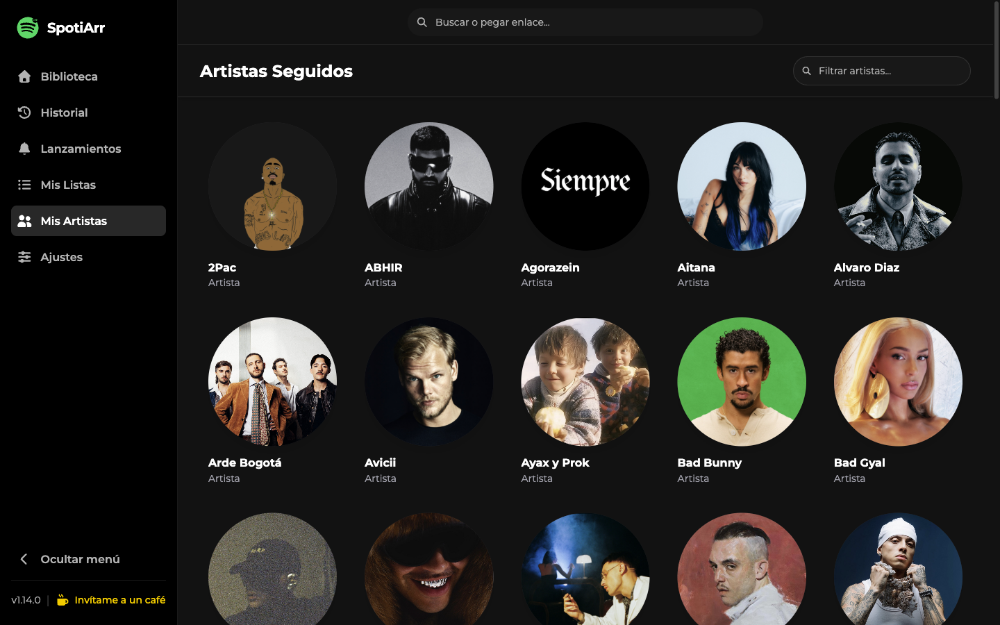
  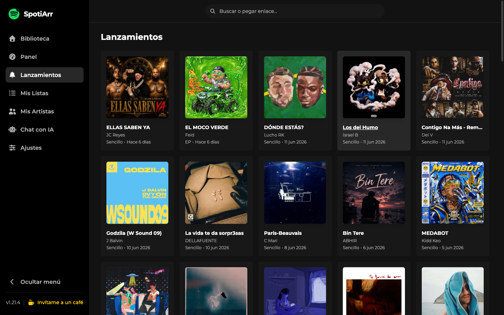
  <br>
  <em>Followed Artists & New Releases Tracking</em>
  <br><br>

  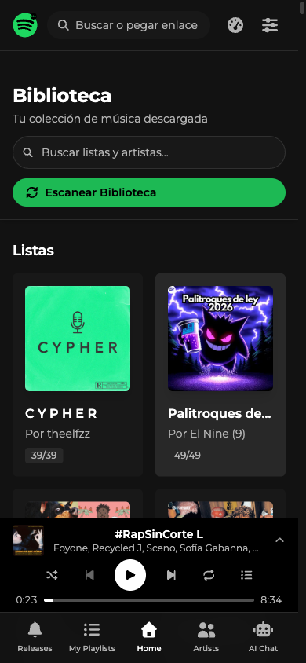
  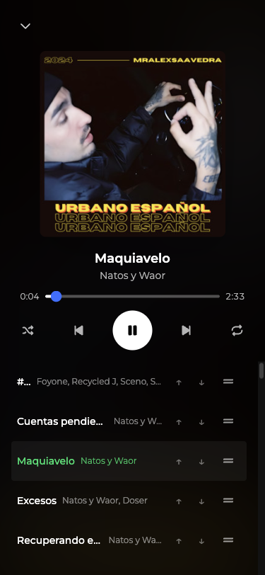
  <br>
  <em>Fully Responsive Mobile Design & Fullscreen Player</em>
  <br><br>

  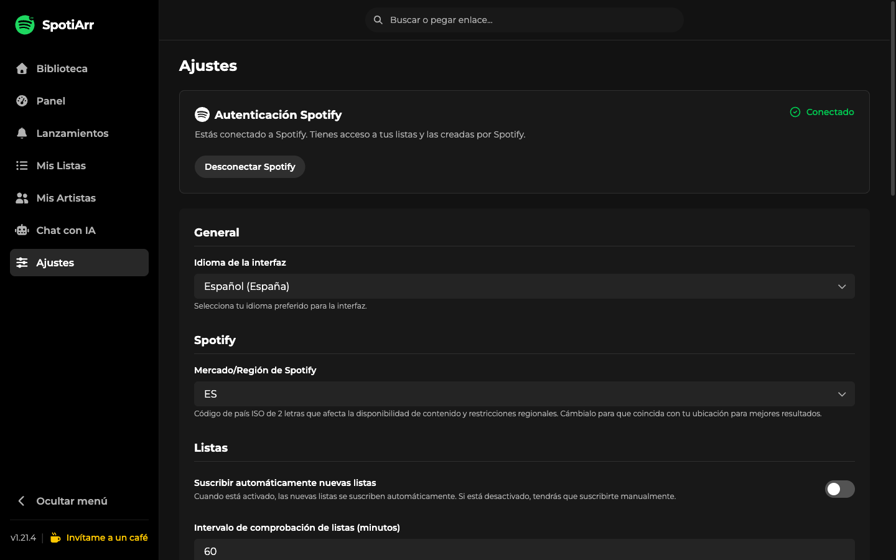
  <br>
  <em>Comprehensive Settings & Preferences</em>
</div>

</details>

## 📱 Application Views

- **🏠 Home (Library):** Browse your downloaded music collection organized by artists, albums, and saved playlists.
- **📊 Dashboard:** Library statistics, most-listened tracks, and download history. (`/history` redirects here.)
- **🔔 Releases:** New releases from your followed artists.
- **💾 My Playlists:** Browse and import your followed Spotify playlists directly.
- **👥 Artists:** Manage your followed artists and view their discography.
- **⚙️ Settings:** Configure download preferences, directories, and application behavior.
- **🤖 AI Chat:** Describe a playlist in natural language; the AI suggests tracks that are resolved on Spotify, downloaded, and saved as an AI-generated playlist (owner: "SpotiArr AI"). Conversation history is persisted server-side in a single global thread and survives reloads and sessions.

## 🚀 Quick Start

### Prerequisites

1. **Get Spotify API credentials** (free):
   - Go to [Spotify Developer Dashboard](https://developer.spotify.com/dashboard)
   - Create an app → note your `Client ID` and `Client Secret`
   - **Set redirect URI:** Add this to your Spotify Developer Dashboard:
   - `http://127.0.0.1:3000/api/auth/spotify/callback` (Local Development)
   - `https://YOUR_SERVER_IP/api/auth/spotify/callback` (Production with Traefik - replace `YOUR_SERVER_IP` with actual IP)

2. **Run with Docker Compose** (recommended):

   Includes Redis, Traefik (Reverse Proxy), health checks, and persistent storage.

```bash
# 1. Clone repo
git clone https://github.com/mralexsaavedra/spotiarr.git && cd spotiarr

# 2. Configure
cp .env.example .env
# Edit .env → add:
#   SPOTIFY_CLIENT_ID=your_client_id
#   SPOTIFY_CLIENT_SECRET=your_client_secret
#   # Configure Callback URL (Note: No port 3000 needed with Traefik)
#   SPOTIFY_REDIRECT_URI=https://YOUR_SERVER_IP/api/auth/spotify/callback
#   DOWNLOADS_DIR=/path/to/downloads
#   PUID=1000  # Optional (Linux/NAS)
#   PGID=1000  # Optional (Linux/NAS)

# 3. Start
docker compose up -d
```

3. **Open** → `https://YOUR_SERVER_IP` 🎉
   - Accept the self-signed certificate warning (Traefik generates this automatically)
   - Login with Spotify to authorize the app

## 📦 Installation

### Build from Source

**Requirements:** Node.js 20+, pnpm 9+, Redis, FFmpeg, yt-dlp, Python 3.11/3.12

```bash
# 1. Setup
git clone https://github.com/mralexsaavedra/spotiarr.git && cd spotiarr
corepack enable
pnpm install

# 2. Install services (macOS example)
brew install redis ffmpeg yt-dlp
brew services start redis

# 3. Configure
cp .env.example .env
cp apps/backend/.env.example apps/backend/.env
# Edit .env → add Spotify credentials + set REDIS_HOST=localhost
# Note: Downloads are saved to './downloads' by default

# 4. Prepare local dev database and generated packages
pnpm setup:dev

# 5. Run
pnpm dev
# Frontend: http://localhost:5173 (Hot Reload)
# Backend:  http://localhost:3000 (API)
```

### Frontend E2E Commands

Build the shared package before running Playwright in a fresh checkout:

```bash
pnpm --filter @spotiarr/shared run build
pnpm --filter frontend run test:e2e:mocked
pnpm --filter frontend run test:e2e:real
pnpm --filter frontend run test:e2e
```

## ⚙️ Configuration

### Environment Variables

**User-configurable variables:**

| Variable                | Required    | Default | Description                                      |
| ----------------------- | ----------- | ------- | ------------------------------------------------ |
| `SPOTIFY_CLIENT_ID`     | ✅          | -       | Spotify app Client ID                            |
| `SPOTIFY_CLIENT_SECRET` | ✅          | -       | Spotify app Client Secret                        |
| `SPOTIFY_REDIRECT_URI`  | ✅          | -       | Full Callback URL (e.g. `https://IP/...`)        |
| `DOWNLOADS_DIR`         | ✅ (Docker) | -       | Host path for downloads mapping (Docker Compose) |
| `PUID`                  | ❌          | `1000`  | User ID for file permissions (Linux/NAS)         |
| `PGID`                  | ❌          | `1000`  | Group ID for file permissions (Linux/NAS)        |

**Advanced Configuration:**

| Variable     | Default | Description                                |
| ------------ | ------- | ------------------------------------------ |
| `REDIS_HOST` | `redis` | Hostname of Redis server (for external DB) |
| `REDIS_PORT` | `6379`  | Port of Redis server                       |

**Instance Authentication (optional — recommended for internet-exposed instances):**

| Variable                     | Default | Description                                                                                                                                   |
| ---------------------------- | ------- | --------------------------------------------------------------------------------------------------------------------------------------------- |
| `SPOTIARR_TOKEN`             | -       | Shared secret to gate the instance (minimum 16 characters). Unset = open LAN access, zero behavior change.                                    |
| `SPOTIARR_SESSION_TTL_HOURS` | `168`   | Session lifetime in hours (default: 7 days). Cookie expires after this period.                                                                |
| `SPOTIARR_UNLOCK_RATELIMIT`  | `5`     | Max unlock attempts per minute per IP before returning 429.                                                                                   |
| `SPOTIARR_TRUST_PROXY`       | -       | Number of proxy hops (e.g. `1`), or `true`/`false`/preset. **Required** behind any reverse proxy for correct IP resolution and Secure cookie. |
| `SPOTIARR_CORS_ORIGIN`       | -       | Comma-separated CORS origin allowlist. Unset = no CORS (the SPA and API are same-origin, so none is needed). Wildcard `*` is rejected.        |

### Exposing SpotiArr to the internet

The instance token gate is **optional**. Without `SPOTIARR_TOKEN` set, SpotiArr behaves exactly as before — fully open for trusted LAN use.

To expose the instance to the internet safely:

1. **Generate a strong token** and add it to your `.env`:

   ```bash
   openssl rand -base64 32
   # → paste the output as SPOTIARR_TOKEN=<value>
   ```

   The token must be at least 16 characters. Rotating it invalidates all active sessions immediately (sessions are signed with the token itself).

2. **Set `SPOTIARR_TRUST_PROXY`** if you are behind a reverse proxy (Pangolin, Traefik, Nginx, Caddy, Cloudflare Tunnel, etc.). Without this, rate limiting uses the wrong IP and the Secure cookie flag may not be set. For a single proxy hop, use `SPOTIARR_TRUST_PROXY=1`.

3. **No URL config needed for the gate itself.** The only URL you must configure when going public is `SPOTIFY_REDIRECT_URI` — it must point to your public hostname (`https://your-domain.com/api/auth/spotify/callback`) and that exact URI must be whitelisted in your Spotify Developer Dashboard app settings.

See the table above for all related variables and their defaults.

**Note regarding HTTPS:**
The included `compose.yml` uses **Traefik** as a reverse proxy to handle HTTPS automatically on port 443. This is required for Spotify authentication on remote servers. SpotiArr itself runs on HTTP (port 3000) internally.

> For advanced/internal variables, see [CONTRIBUTING.md](CONTRIBUTING.md#environment-variables)

### In-App Settings

Most options are configured via the **Settings** page (stored in database):

- **Spotify Market/Region** → ISO country code for content availability
- **Downloads path** → where files are saved
- **Audio format** → mp3, m4a, etc.
- **YouTube cookies** → paste content of cookies.txt for age-restricted content (optional)
- **M3U generation** → auto-create playlist files
- **Download rate limit** → avoid YouTube throttling
- **Playlist sync interval** → how often to check for new tracks (default: 60 min)
- **AI Playlist Generation** (stored in DB, never in `.env`):
  - **AI Provider** → `openai`, `gemini`, `openrouter`, `groq`, `nvidia`, `ollama`, `ollama-cloud`, `lmstudio`, `vercel`, `custom`
  - **AI Base URL** → pre-filled per provider, overridable
  - **AI API Key** → stored in DB Settings table, never in environment variables
  - **AI Model** → select from discovered model list or enter manually

## 📁 File Organization

SpotiArr follows Jellyfin/Plex best practices:

```
downloads/
├── Playlists/
│   └── My Playlist/
│       ├── 01 - Artist - Track.mp3
│       ├── My Playlist.m3u8
│       └── cover.jpg
└── Artist Name/
    └── Album Name/
        ├── 01 - Track.mp3
        └── cover.jpg
```

- **AI-generated playlists** (owner "SpotiArr AI") are stored under `Playlists/<name>/` like regular playlists.
- **Metadata** embedded in files (artist, album, year, cover)
- **M3U playlists** auto-generated for easy import
- **Cover art** saved as `cover.jpg` + embedded

## ⚠️ Known Limitations

> [!WARNING]
> **Spotify API changes (February 2026)** introduced restrictions that affect the following features:

| Feature                       | Status          | Notes                                                                                                       |
| ----------------------------- | --------------- | ----------------------------------------------------------------------------------------------------------- |
| Download via artist URL       | ❌ Removed      | Spotify removed the top-tracks endpoint. Use album or playlist URLs instead.                                |
| Third-party playlist download | ⚠️ Restricted   | Only your own playlists are guaranteed to be accessible. Other users' playlists may return an access error. |
| Search results per type       | ℹ️ Capped at 10 | Spotify enforces a maximum of 10 results per type (tracks, albums, artists).                                |

> [!NOTE]
> **Catalog data mitigation**: Public catalog calls (artist discography, album tracks, release feed) are now served primarily via **Deezer** with **MusicBrainz** fallback, and **Spotify** as a terminal fallback. Spotify remains required for OAuth, user library data (followed artists, playlists), and search.

## 🛠️ Development

Contributions welcome! See [CONTRIBUTING.md](CONTRIBUTING.md) for setup, workflow, and guidelines.

**Quick commands:**

```bash
pnpm dev       # Setup dev, shared watcher, backend + frontend
pnpm setup:dev # Build shared package + apply DB migrations + generate Prisma client
pnpm lint      # ESLint + Prettier
pnpm build     # Production build
```

**Architecture:**

> 📖 **Read the Story:** See [docs/ARCHITECTURE.md](docs/ARCHITECTURE.md) (Español) or [docs/ARCHITECTURE.en.md](docs/ARCHITECTURE.en.md) (English) for a deep dive into the project's initiative, monorepo structure, and technical decisions.

- **Backend:** Express + Prisma + BullMQ + SQLite
- **Frontend:** React 19 + Vite + TanStack Query + Tailwind v4 + Zustand
- **Queue:** Redis + BullMQ for download jobs
- **Processing:** FFmpeg + yt-dlp

## 📝 Changelog

See [CHANGELOG.md](CHANGELOG.md) for version history.

## 💬 Support

- 🐛 [Open an issue](https://github.com/mralexsaavedra/spotiarr/issues)
- 💡 [Discussions](https://github.com/mralexsaavedra/spotiarr/discussions)
- ⭐ Star the repo if you find it useful!

## ⚖️ License

[MIT](LICENSE) © [mralexsaavedra](https://github.com/mralexsaavedra)

---

<div align="center">

Made with ❤️ for the self-hosting community

[](https://buymeacoffee.com/mralexsaavedra)

</div>
